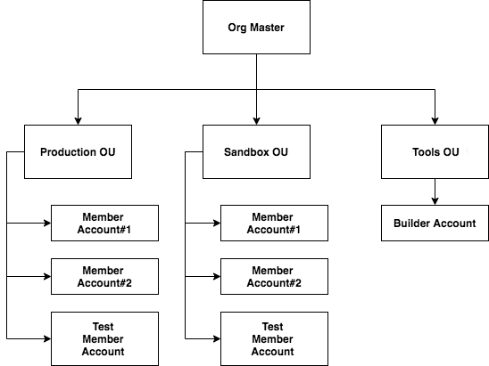
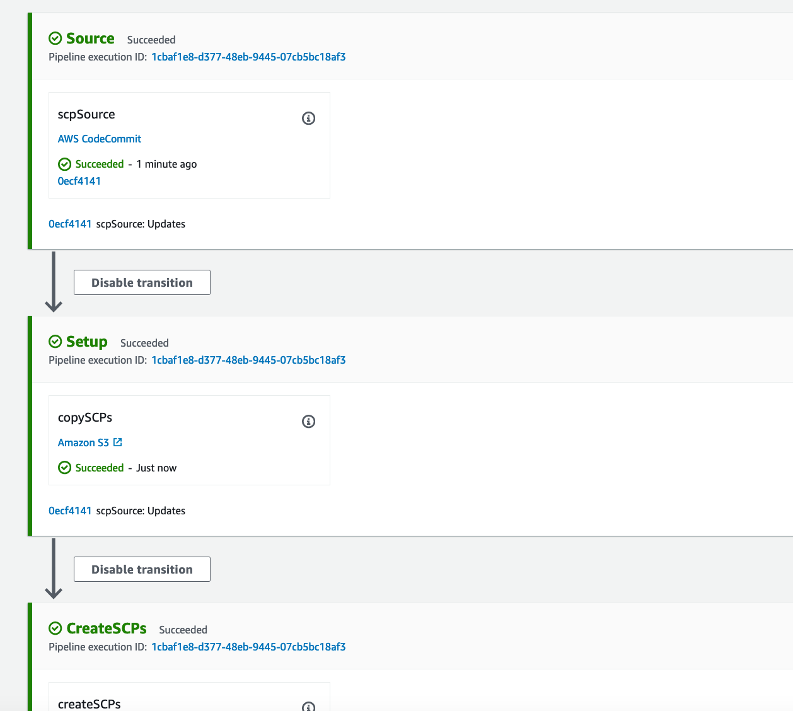
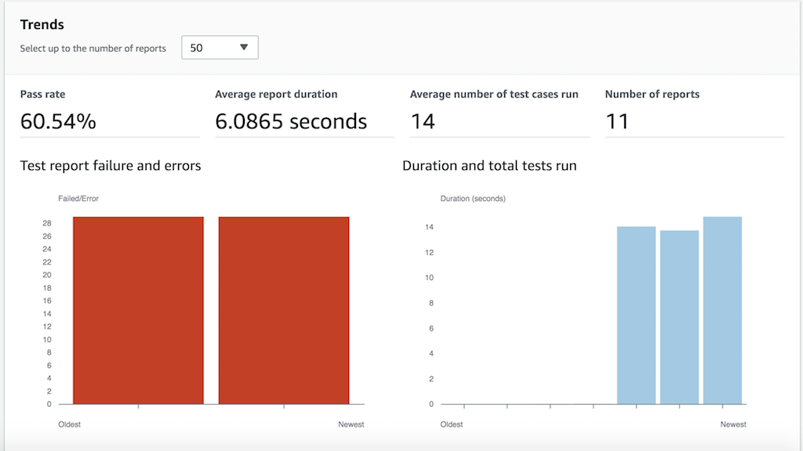

# Service Control Policies Deployment

#### Table of Contents

* [Outcome](#outcome)
* [Problem statement](#problem-statement)
* [What do I need?](#what-do-i-need)
* [How will this work?](#how-will-this-work)
* [Where are my policies and tests?](#where-are-my-policies-and-tests)
    + [SCP repository](#scp-repository)
    + [Behave acceptance tests repository](#behave-acceptance-tests-repository)
* [How are the tests written?](#how-are-the-tests-written)
* [Steps to deploy the stack](#steps-to-deploy-the-stack)
    + [Pre-requisites](#pre-requisites)
    + [Let's begin](#lets-begin)
* [Cleanup](#cleanup)
* [Security](#security)
* [License](#license)

## Outcome

- Multi-OU service control policies (SCP) deployment pipeline
- Acceptance tests for the SCPs using behave tests and policy simulator

## Problem statement

Customers need deployment and testing of their service control policies used for enabling services
using AWS Organizations.

## What do I need?

Let's consider the below AWS organisation structure.



- The AWS Organizations has three OUs
- Tools OU has the builder account for building the infrastructure
- Member accounts are split into production and sandbox OUs for the demo
- We have a _test account_ in each OU
- As a **pre-requisite** for this code sample, you will need 3 AWS accounts
    - Org management account which is the root account
    - Builder account in the tools OU
    - Test account in a sandbox OU

## How will this work?

- Store the SCPs in a code-commit repository of the builder account
- This builder account will have a _metadata file_ with the details of the SCPs and the OUs where it
  will be delivered
- The code pipeline will read the metadata file and execute the create or update for the SCPs
- The _test account_ of the selected OU will be having a test suite which can be executed to verify
  the SCPs
- The _test report_ output will provide us the summary of SCP acceptance tests

## Where are my policies and tests?

### SCP repository

Contains all the SCPs you want to apply to your OUs within the organization. The source code
is [here](./repos-for-code-commit/policies)

- Each folder within the scp folder maps to an organization unit (OU) in the org

```
infra-policies
    └── scp
        ├── metadata.json
        ├── production
        │         ├── allowed.json
        │         └── restricted.json
        ├── sandbox
        │         ├── allowed.json
        │         └── restricted.json
        └── tools
            ├── allowed.json
            └── restricted.json
```

- Provide SCPs destination and files as declarative specifications in JSON

```
{
  "ou-ids": [
    {
      "id": "ou-abcd-e3fghj1k",
      "dir_name": "production",
      "scps": ["allowed.json", "restricted.json"]
    },
    {
      "id": "ou-abcd-vsp4rv23",
      "dir_name": "sandbox",
      "scps": ["allowed.json", "restricted.json"]
    },
    {
      "id": "ou-abcd-un0t6khx",
      "dir_name": "tools",
      "scps": ["allowed.json", "restricted.json"]
    }
  ]
}

```

### Behave acceptance tests repository

Contains the acceptance tests using the policy simulator. Will be executed within the selected AWS
test account residing in the OU. The source code is [here](./repos-for-code-commit/tests)

```
acceptance-tests
         ├── behave.ini
         ├── buildspec.yml
         ├── features
         │         ├── appmesh-actions.feature
         │         ├── appstream-actions.feature
         │         ├── cloudformation-actions.feature
         │         ├── dynamodb-actions.feature
         │         ├── ec2-actions.feature
         │         ├── iam-actions.feature
         │         └── lambda-actions.feature
         ├── requirements.txt
         └── steps
             ├── policy_simulator.py
             └── step_impl.py
```

## How are the tests written?

- We will use [policy simulator](repos-for-code-commit/tests/steps/policy_simulator.py) to verify
  the IAM actions
- Below is a sample feature file for testing the IAM actions

```
Feature: Verify IAM actions

  Scenario Outline: Check if the IAM actions are allowed
      Given I invoke <service>:<action>
      When the region selected is <region>
      Then the status should be <result>

      Examples:
          | service | action                        | region     | result  |
          | iam     | ListPolicies                  | eu-west-2  | allowed |
          | iam     | GetPolicy                     | eu-west-2  | allowed |
          | iam     | TagRole                       | eu-west-2  | allowed |
          | iam     | DeleteRole                    | eu-west-2  | allowed |
          | iam     | DeleteRolePermissionsBoundary | eu-west-2  | allowed |
```

- The result of allowed or denied is based on the policy simulator response object
  key `EvalDecision`
- Below snippet asserts the response in
  the [test implementation](repos-for-code-commit/tests/steps/step_impl.py)

```
    if eval_decision in ['explicitDeny', 'implicitDeny']:
        eval_decision = 'denied'
        assert eval_decision == result
        assert allowed_by_organisation is False
    elif eval_decision == 'allowed':
        assert eval_decision == result
        assert allowed_by_organisation is True
```

## Steps to deploy the stack

### Pre-requisites

- Ensure the AWS CLI v2 is configured and AWS_DEFAULT_REGION is set
  ```shell
  export AWS_DEFAULT_REGION=$(aws configure get region)
  echo $AWS_DEFAULT_REGION
  ```
- Ensure you have node and npm installed
  ```shell
  node -v
  npm -v
  ```
- Install `jq`. For macOS, `brew install jq`
- Install `git-remote-codecommit` - `pip install git-remote-codecommit`

### Let's begin

- Clone this repository and install dependencies
  ```shell
  npm install -g -f aws-cdk@2.26
  cd $HOME && mkdir -p environment && cd environment
  git clone https://github.com/aws-samples/aws-service-control-policies-deployment
  cd $HOME/environment/aws-service-control-policies-deployment
  ```
- Export the AWS builder account ID for your infrastructure
  ```shell
  export BUILDER_AWS_ACCOUNT_ID=123456789012
  echo $BUILDER_AWS_ACCOUNT_ID
  ```
- Install project dependencies and build the project
  ```shell
  npm install
  npm run build
  npm run test
  ```
- Export the AWS credentials for the org management account and execute the below commands
  ```shell
  cdk bootstrap
  cdk deploy SetupOrgManagementStack
  export ORG_MANAGEMENT_ASSUMABLE_ROLE_ARN=$(aws cloudformation describe-stacks --stack-name SetupOrgManagementStack --query 'Stacks[*].Outputs[?ExportName==`orgManagementAssumableRoleArn`].OutputValue' --output text)
  echo $ORG_MANAGEMENT_ASSUMABLE_ROLE_ARN
  ```
- Export the AWS credentials of the builder account and clone the CodeCommit repository for storing
  SCPs
  ```shell
  cdk bootstrap
  cdk deploy SetupBuilderAccountStack
  export SCP_REPO_NAME=service-control-policies
  export SCP_REPO_URL=$(aws cloudformation describe-stacks --stack-name SetupBuilderAccountStack --query 'Stacks[*].Outputs[?ExportName==`scpRepoCloneUrlGrc`].OutputValue' --output text)
  cd $HOME/environment && git clone $SCP_REPO_URL && cd $SCP_REPO_NAME
  ```
- Edit the [metadata.json](./repos-for-code-commit/policies/scp/metadata.json) to use the OU ids
  from your AWS Organizations
- Push the SCPs into the CodeCommit repository
  ```shell
  cp -R $HOME/environment/aws-service-control-policies-deployment/repos-for-code-commit/policies/ .
  git checkout -b main
  git remote -v
  git add .
  git commit -m "First commit"
  git push --set-upstream origin main
  ```
- This will trigger the SCP deployment. Here is the successful execution screenshot
  
- Once completed successfully, proceed with below steps
- Export the AWS credentials of the test account and clone the CodeCommit repository for storing
  acceptance tests
  ```shell
  cdk bootstrap
  cdk deploy SetupMemberAccountStack
  export TESTS_REPO_NAME=acceptance-tests
  export TESTS_REPO_URL=$(aws cloudformation describe-stacks --stack-name SetupMemberAccountStack --query 'Stacks[*].Outputs[?ExportName==`acceptanceTestsRepoCloneUrlGrc`].OutputValue' --output text)
  cd $HOME/environment && git clone $TESTS_REPO_URL && cd $TESTS_REPO_NAME
  ```
- Push the acceptance tests into the CodeCommit repository
  ```shell
  cp -R $HOME/environment/aws-service-control-policies-deployment/repos-for-code-commit/tests/ .
  git checkout -b main
  git remote -v
  git add .
  git commit -m "First commit"
  git push --set-upstream origin main
  ```
- This will trigger the acceptance tests using AWS CodeBuild
- The reports will be generated in the _test account_. Below is a sample acceptance test report.



## Cleanup

* Delete the AWS CloudFormation stacks in following order
    - SetupMemberAccountStack in test account
    - SetupBuilderAccountStack in builder account
    - SetupOrgManagementStack in org management account
* Detach the tools, sandbox and production SCPs created by this code from OUs in the org management
  account
* Delete the detached SCPs
* You will need to manually delete the S3 bucket in the builder account

# Security

See [CONTRIBUTING](CONTRIBUTING.md#security-issue-notifications) for more information.

# License

This library is licensed under the MIT-0 License. See the [LICENSE](LICENSE) file.

